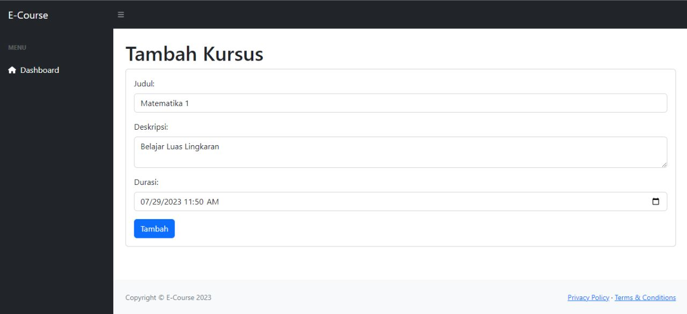
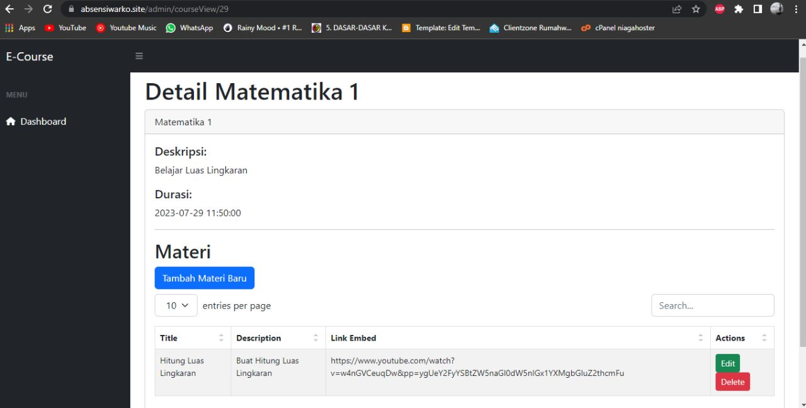
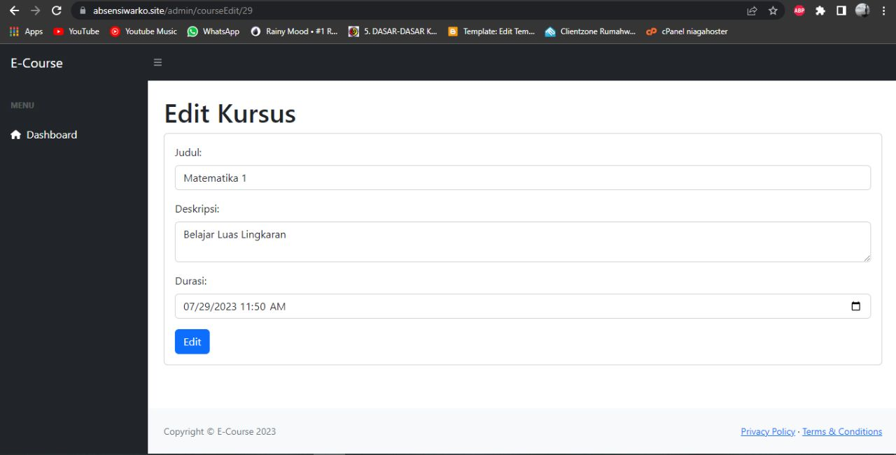
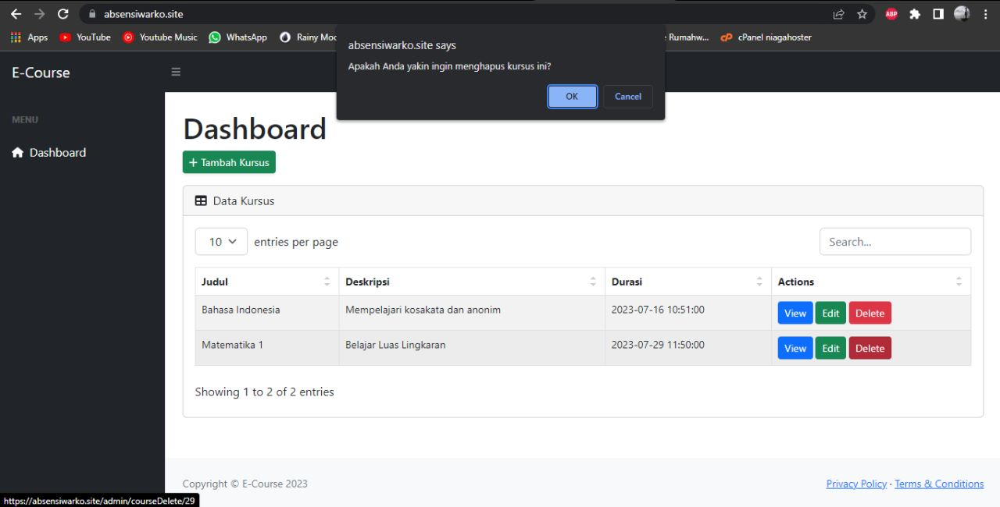
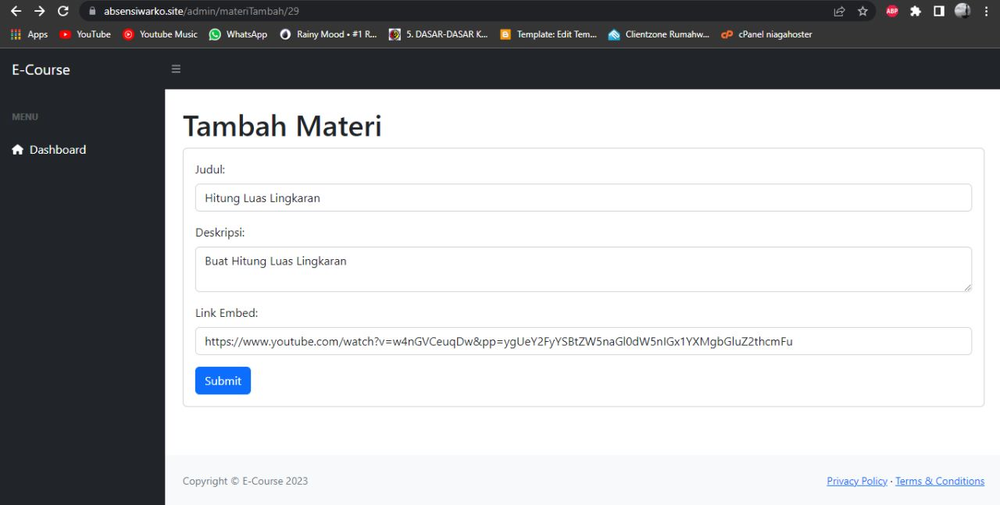
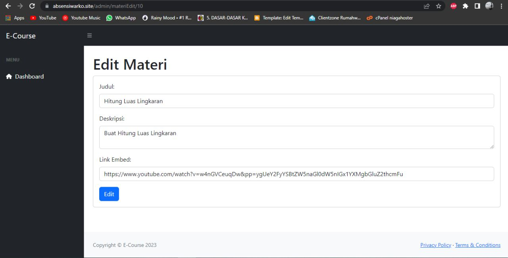
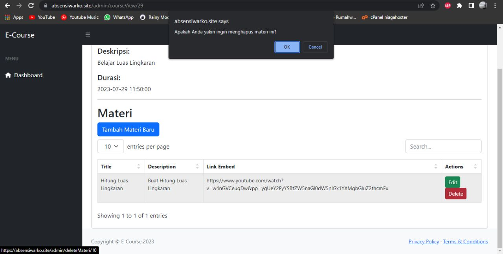

# e-course

## Deskripsi
E-course Adalah Platform Website Untuk Menampilkan, Menambah, Mengedit, dan Menghapus Kursus & Materi.

## Bahasa Program, Framework, Database & Library
- HTML, CSS, JavaScript
- PHP
- MySQL
- Bootstrap 
- CodeIgniter

## Screenshots

### Dashboard

### Tambah Kursus

### Detail Kursus

### Edit Kursus

### Hapus Kursus

### Tambah Materi

### Edit Materi

### Hapus Materi

